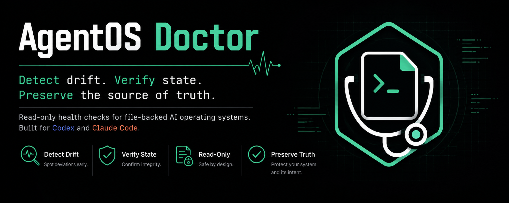

# AgentOS Doctor



AgentOS Doctor is a report-only skill for Codex and Claude Code. It checks the
files that define an AI operating system: the current work surface, structured
state, dashboards, governance rules, and optional review receipts.

Use it when those files may have drifted apart. It reports the specific mismatch
and a small repair for a person to review. It does not edit files, choose
priorities, or move source-of-truth authority.

## How this differs from the native doctor commands

It is deliberately separate from `codex doctor` in Codex and `/doctor` in
Claude Code:

- `codex doctor` checks the Codex installation and runtime.
- Claude Code’s `/doctor` and `claude doctor` check the Claude Code setup and runtime.
- AgentOS Doctor checks the operating files an adopter declares: a live work
  surface, dashboard, structured state, governance gates, and optional receipts.

## Quick start

1. Copy `examples/agentos-doctor.example.json` to your operating-system root
   and replace the sample paths and terms with your own.
2. Keep the canonical skill at `.agents/skills/agentos-doctor/`. This repository
   includes a `.claude/skills/agentos-doctor` link to that same folder, so the
   same version is discoverable by either host.
3. Run:

   ```bash
   python3 .agents/skills/agentos-doctor/scripts/agentos_doctor.py --config agentos-doctor.json
   ```

4. Review warnings; do not let the tool make repairs automatically.

Run the included example from this repository with:

```bash
python3 .agents/skills/agentos-doctor/scripts/agentos_doctor.py --config examples/agentos-doctor.example.json --skip-native
```

## What to configure

Start with the smallest stable set of files:

- required operating-system nucleus;
- live work surface and its freshness date;
- dashboard and JSON state with blockers and next actions;
- approval/source-of-truth terms in governance files.

Receipt recency and native runtime checks are optional. Configuration is
documented in the skill's `references/configuration.md`.

Set `native_runtime.provider` to `codex`, `claude`, or `none`. Choose the host
explicitly when both CLIs are installed. The operating-system checks are the
same in either tool; only the optional host-runtime diagnostic changes.

## Boundaries

This is a diagnostic and reporting layer, not an autonomous operating system.
It must not choose priorities, move source-of-truth authority, patch files,
send messages, or change external systems. Keep the policy in the adopter's
own files, not in the tool.

## Publishing a configuration

The example configuration uses fictional paths and files. Do not commit real
paths, secrets, customer data, or organization-specific policy text to a public
repository.

The launch banner at `assets/agentos-doctor-social.png` is included for the
README and launch materials. Use
`assets/agentos-doctor-github-social.png` as the repository's GitHub social
preview image in repository settings.
